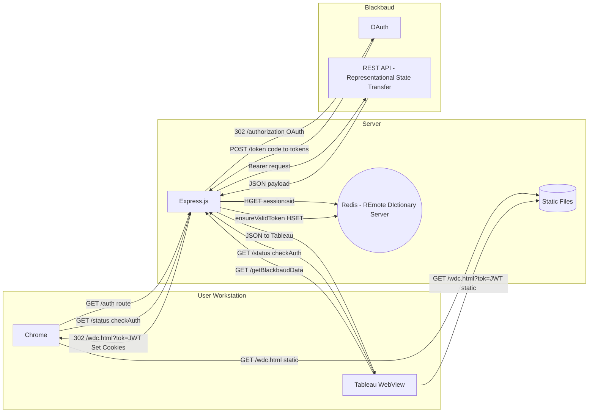

```mermaid
flowchart LR
    subgraph "User Workstation"
        A1[Chrome]
        A2[Tableau WebView]
    end

    subgraph Server
        S1[Express.js]
        S2((Redis - REmote DIctionary Server))
        S3[(Static Files)]
    end

    subgraph Blackbaud
        B1[OAuth]
        B2[REST API - Representational State Transfer]
    end

    A1 -->|GET /wdc.html static| S3
    A1 -->|GET /auth route| S1
    S1 -->|302 /authorization OAuth| B1
    B1 -->|POST /token code to tokens| S1
    S1 -->|302 /wdc.html?tok=JWT Set Cookies| A1
    A2 -->|GET /wdc.html?tok=JWT static| S3
    A1 & A2 -->|GET /status checkAuth| S1
    S1 -->|HGET session:sid| S2
    A2 -->|GET /getBlackbaudData| S1
    S1 -->|ensureValidToken HSET| S2
    S1 -->|Bearer request| B2
    B2 -->|JSON payload| S1
    S1 -->|JSON to Tableau| A2
```