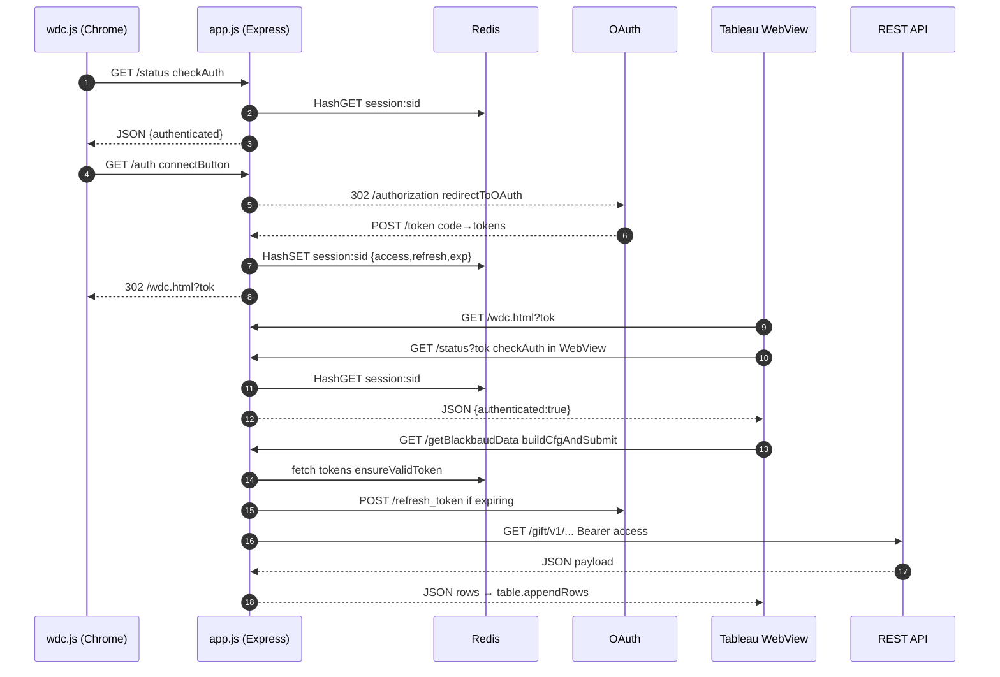

```mermaid
sequenceDiagram
    autonumber
    participant WDC as wdc.js (Chrome)
    participant S   as app.js (Express)
    participant R   as Redis
    participant O   as OAuth
    participant T   as Tableau WebView
    participant P   as REST API

    %% ---------- initial auth check in Chrome ----------
    WDC->>S: GET /status  checkAuth
    S->>R: HashGET session:sid
    S-->>WDC: JSON {authenticated}

    %% ---------- user clicks “Connect” ----------
    WDC->>S: GET /auth  connectButton
    S-->>O: 302 /authorization  redirectToOAuth
    O-->>S: POST /token  code→tokens
    S->>R: HashSET session:sid {access,refresh,exp}
    S-->>WDC: 302 /wdc.html?tok

    %% ---------- Tableau Desktop launches WDC ----------
    T->>S: GET /wdc.html?tok
    T->>S: GET /status?tok  checkAuth in WebView
    S->>R: HashGET session:sid
    S-->>T: JSON {authenticated:true}

    %% ---------- data request from Tableau ----------
    T->>S: GET /getBlackbaudData  buildCfgAndSubmit
    S->>R: fetch tokens  ensureValidToken
    S->>O: POST /refresh_token  if expiring
    S->>P: GET /gift/v1/...  Bearer access
    P-->>S: JSON payload
    S-->>T: JSON rows → table.appendRows

```